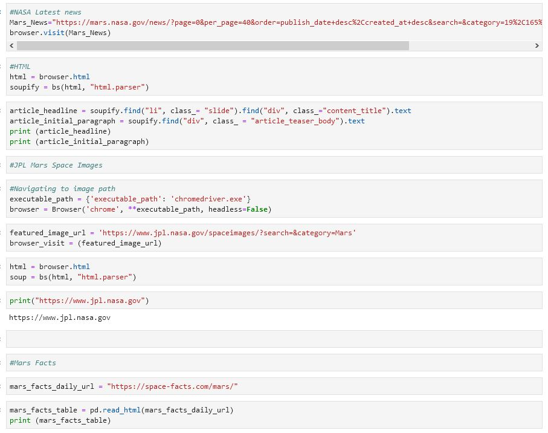
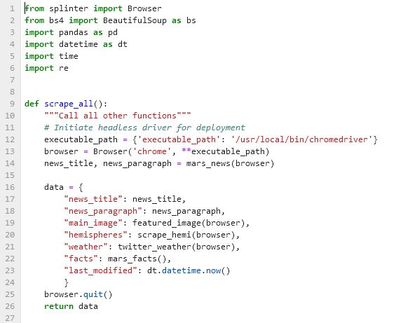

# Mission to Mars

## Project Purpose
Build a web application that scrapes various websites for data related to the Mission to Mars and displays the information in a single HTML page.

## Process

### Step 1 - Scraping
Initial scraping utilizing Jupyter Notebook, BeautifulSoup, Pandas, and Requests/Splinter.

- Code snippet of sacraping and analysis tasks 

### Step 2 - MongoDB and Flask Application

Using MongoDB and Flask templating to create a new HTML page that displays all of the information that was scraped from the previous step.  This was possible by converting the Jupyter notebook into a python script called scrape_mars.py with a function called scrape.

## Results

